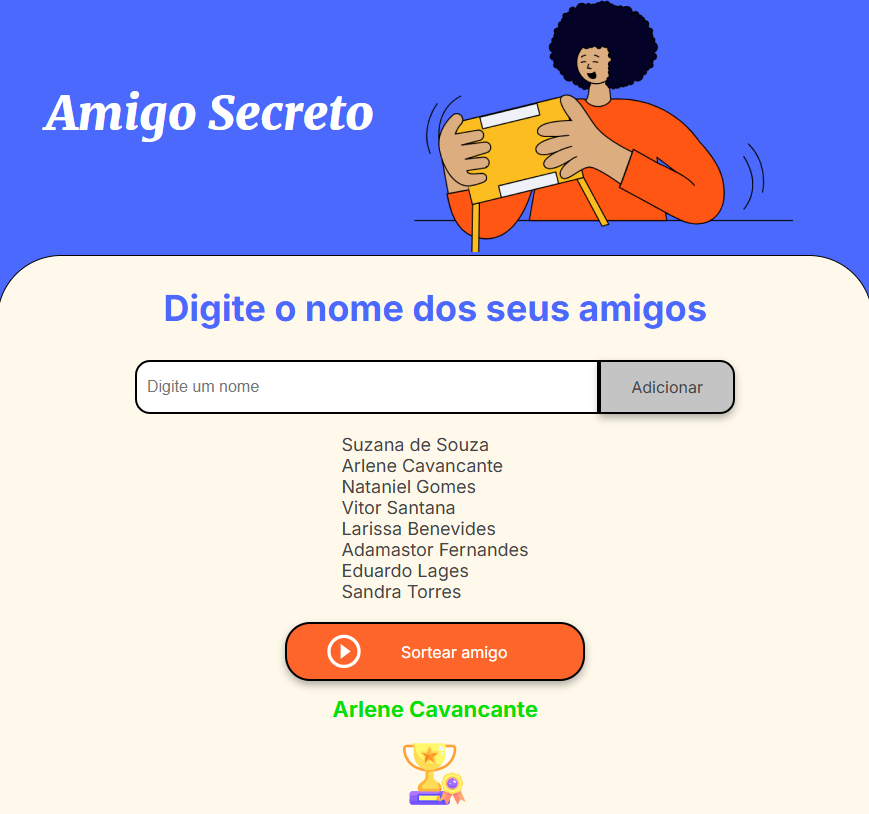

# Challenge do Amigo Secreto

 

Este é um jogo de Amigo Secreto, uma brincadeira popular onde amigos trocam presentes de forma anônima. Este aplicativo permite que você sorteie um amigo secreto de uma lista de nomes.

## Funcionalidades

- **Adicionar Nome**: Permite adicionar nomes à lista de participantes.
- **Sortear Amigo**: Sorteia um nome aleatoriamente da lista de participantes.

## Como Usar

1. Digite o nome de um amigo no campo de texto.
2. Clique no botão "Adicionar" para incluir o nome na lista.
3. Repita os passos 1 e 2 até que todos os nomes dos participantes estejam na lista.
4. Clique no botão "Sortear amigo" para sortear um nome da lista.
5. O nome sorteado será exibido abaixo do botão de sorteio.

## Tecnologias Utilizadas

- HTML
- CSS
- JavaScript

## Contribuição

Sinta-se à vontade para contribuir com melhorias ou novas funcionalidades para este jogo de Amigo Secreto.

## Descrição da Imagem

A imagem mostra a interface de um aplicativo de Amigo Secreto. No topo, há o título "Amigo Secreto" e uma ilustração de uma pessoa segurando um presente. Abaixo, há um campo de texto onde você pode digitar o nome dos seus amigos e um botão "Adicionar" para incluir o nome na lista. A lista de nomes adicionados é exibida abaixo do campo de texto. Os nomes na lista são:

- Suzana de Souza
- Arlene Cavancante
- Nataniel Gomes
- Vitor Santana
- Larissa Benevides
- Adamastor Fernandes
- Eduardo Lages
- Sandra Torres

Há também um botão laranja com o texto "Sortear amigo" que, quando clicado, sorteia um nome da lista. No exemplo da imagem, o nome sorteado foi "Arlene Cavancante", que é exibido em verde abaixo do botão de sorteio, junto com um ícone de troféu.
